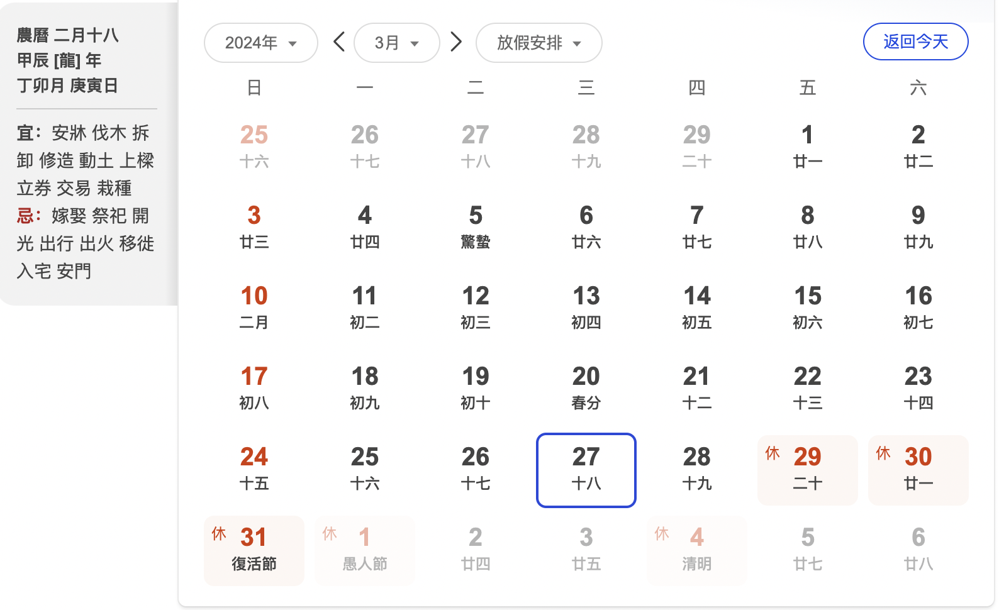

# 小六壬

时辰起卦方法

这里先得到当前的时辰

运行test.py, 输入当前的小时

```shell
python3 test.py 
请输入当前时间，小时，24小时
17
17 对应的时辰是：申时 (9时)
```

然后百度当前的农历日期



月份+ 日 + 时辰 得到数字

021809

运行index.py

```shell
python3 index.py 
请输入农历日期和时辰（格式为月日时，例如062211）：021809
2月 对应的规则是：留连
18号 对应的规则是：大安
9时辰 对应的规则是：速喜
留连意味着时光延续，连续不断。这个时辰适宜于持续进行某项事务，表示顺利连续。
大安是一天中最吉利的时辰之一，代表吉祥安康，适宜进行各种重要的活动，如求婚、搬家、开业等。
速喜时辰代表喜悦来临，适宜进行喜庆活动，如举办婚礼、庆祝生日等。
```

后续:

1. 可以增加gpt-3.5模型，生成小六壬的时辰起卦方法。

2. 可以增加紫微斗数起卦方法。

3. 可结合gpt-3.5对卦名做进一步解析

4. 可生成后端接口提供前端调用